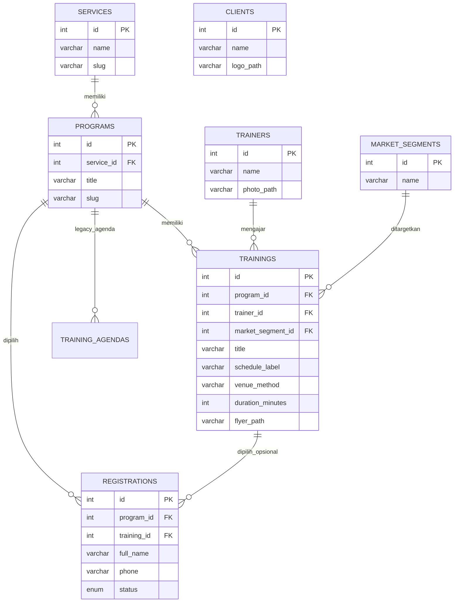

# ERD Sistem Informasi Sahabat Nara

Catatan:

- `services` menyimpan kelompok layanan seperti `HR Training`.
- `programs` menyimpan nama program seperti `Human Resources Basic Training (HR for Non HR)`.
- `trainings` menyimpan topik/kelas yang benar-benar dipilih peserta, termasuk trainer, waktu, metode, durasi, segment pasar, dan flyer.
- `registrations` tetap menjadi pusat proses pendaftaran peserta ke admin.
